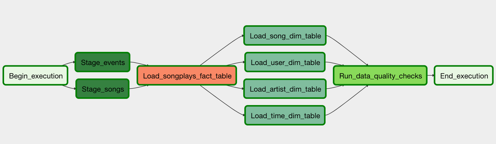
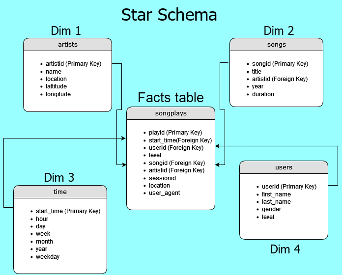

# Data Pipelines with Airflow

Project submission for Udacity Data Engineering Nano Degree

Author: Chris Marshall

## Project Summary

The music streaming app start up company, Sparkify, is looking to hire a Data Engineer! They want more control of their data and you are tasked to use Apache airflow by adding data quality checks and more automation by monitoring their data warehouse ETL pipelines!

Sparkify is providing you to work with two datasets residing in S3(Amazon Simple Storage Service) and needs to be processed in Sparkify's data warehouse located in Amazon Redshift. The datasets consist of JSON logs that tell about user activity in the app and JSON metadata about user song info.

You are tasked to configure a DAG with the following guidelines:
*   The DAG does not have dependencies on past runs
*   On failure, the task are retried 3 times
*   Retries happen every 5 minutes
*  Catchup is turned off
*  Do not email on retry

### Here is a graph view of the DAG running successfully with correct task dependencies

## Schema Design

## Operator Architecture
    
### Stage Operator:
  `stage_redshift.py`      
* Successfully loads JSON formatted files from S3 to Amazon Redshift.
* Uses parameters to specify S3 location and target table.
* Applies templated fields for loading timestamped files based on execution time.

### Fact Operator:
  `load_fact.py`      
* Efficiently loads data into the songplays fact table.
* Uses our provided SQL statement for the insertion process.
* Inherits parameters for Redshift connection, destination table, SQL query, and schema.

### Dimension Operator:
`load_dimension.py`
* Efficiently loads data into the song, user, artist, and time tables.
* Uses our provided SQL statement for the insertion process.
* Inherits parameters for Redshift connection, destination table, SQL query, schema, and an optional truncate flag for table emptying before loading.

 ### Data Quality Operator:
`data_quality.py`       
* Validates data quality by running checks on all tables in our Redshift database.
* Executes SQL queries to count the number of records in each table.
* Raises an exception if a table has no results.

## Getting Started and Usage

* Make sure to have Python installed on your system. You can download python from the official website: [Python Downloads](https://www.python.org/downloads/)

* To access Airflows web server enter the following command:

    `/opt/airflow/start.sh`

* Once in the UI click on Admin>>Connections>>Create and enter the following in the appropriate values:

    `Conn Id: aws_credentials`
    
    `Conn Type: Amazon Web Services`

    `Login: Access key ID (IAM user credentials)`

    `Password: Secret Access Key (IAM user credentials)`

* Save and create another connection with following values:

    `Conn Id: redshift`

    `Conn Type: Postgres`

    `Host: your redshift clusters endpoint`

    `Schema: your redshift database (dev is default)`

    `Login: awsuser is default`

    `Password: your password for your redshift cluster`

    `Port: 5439`

* Save connection and now you can run airflow with your redshift cluster

## References 

[AWS Docs](https://docs.aws.amazon.com/)

[Airflow Docs](https://airflow.apache.org/docs/)

[Airflow Macros](https://airflow.apache.org/docs/apache-airflow/1.10.5/macros.html)

[Redshift Cluster Guide](https://docs.aws.amazon.com/redshift/latest/gsg/rs-gsg-launch-sample-cluster.html)
